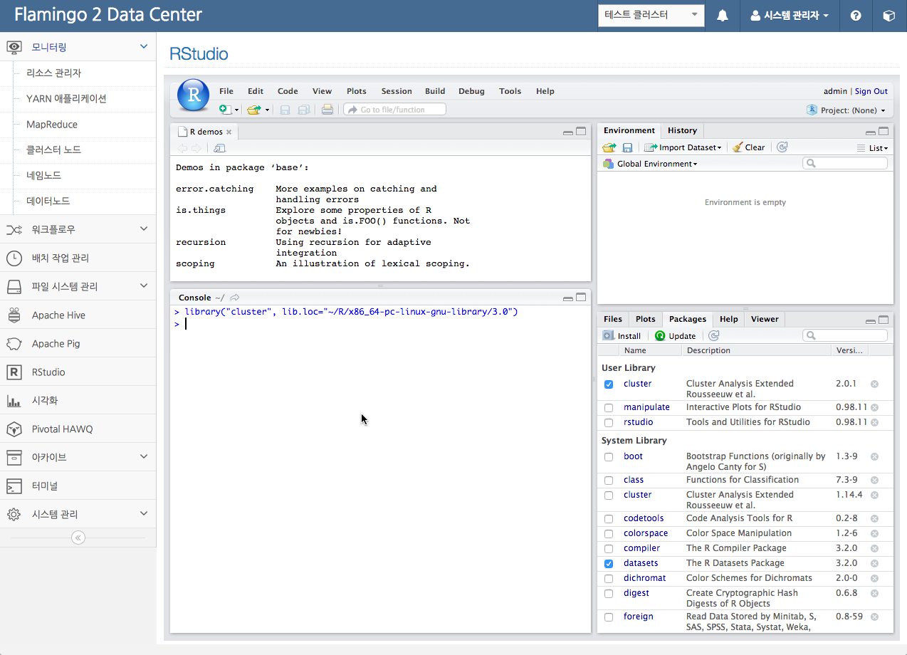
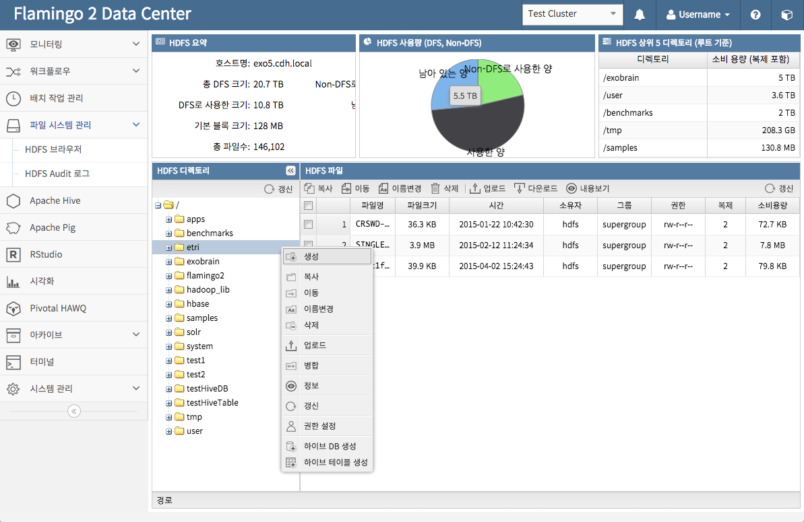
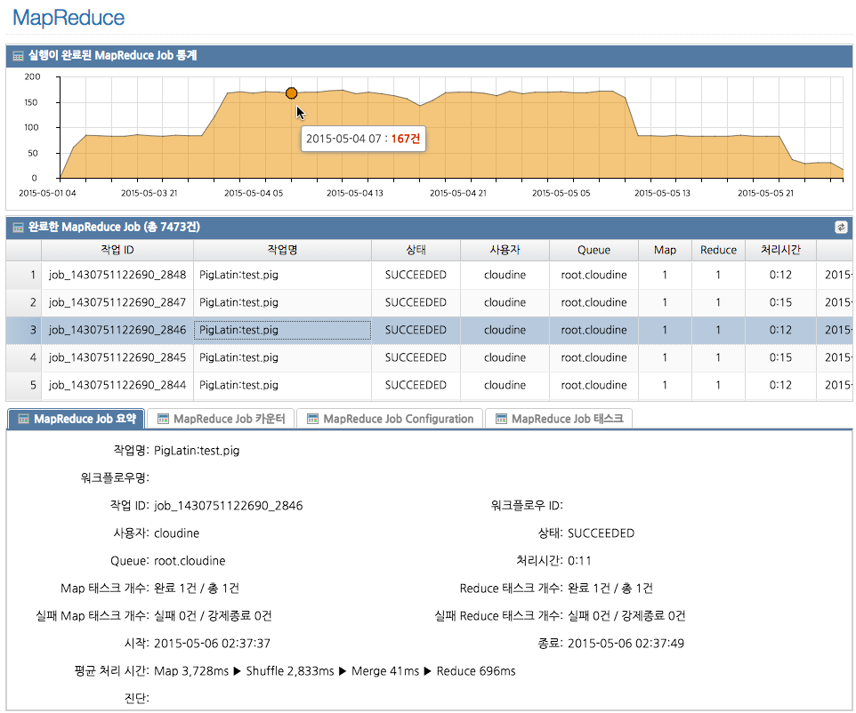
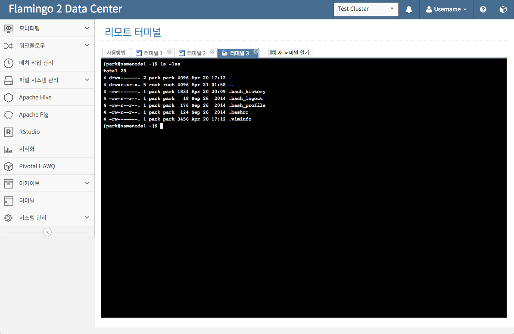
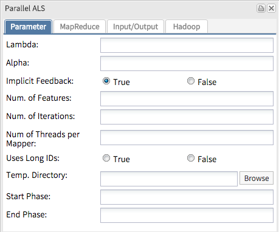
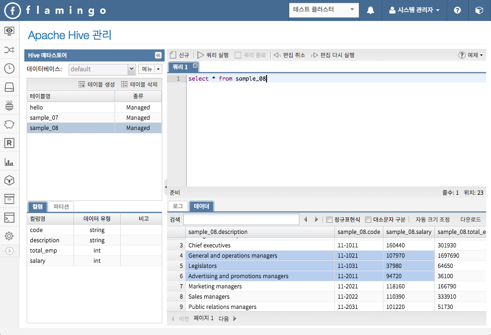
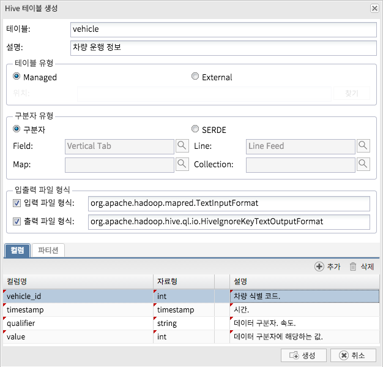
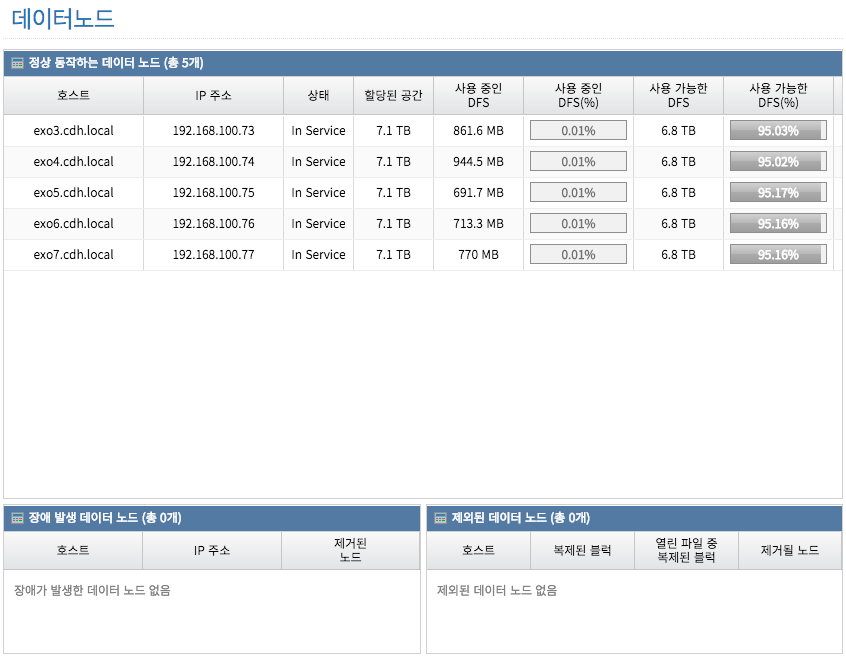
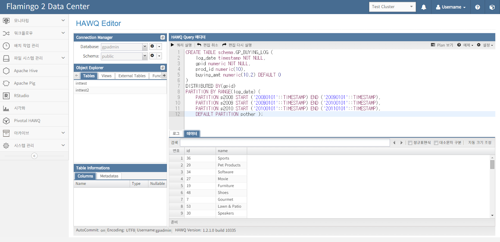

## Flamingo 2 Big Data Platform

Flamingo는 Apache Hadoop EcoSystem을 기반으로한 빅데이터 인프라 환경을 보다 편리하고 분석 및 개발에 집중할 수 있으면서, 다양한 사용자들이 협업할 수 있는 환경을 제공해주는 빅데이터 플랫폼입니다.

### 라이센스

* Dual License
  * Community License : GPL v3
  * Commercial License : 본 문서의 하단에 Commercial 지원 부분 참고

### Flamingo 1 대비 주요 변경사항

* 통계 및 차트 기능 강화
* 시각화 기능 추가
* Hive 관련 기능 재개발
* Pig 관련 기능 재개발
* HDFS 브라우저 관련 기능 재개발
* 워크플로우 디자이너 BPM 적용
* Mahout 통합
* Spark 지원 추가
* Pivotal HAWQ 관련 기능 추가
* ExtJS 4 > ExtJS 5 마이그레이션
* 프로젝트 구성 변경
* 모니터링 Agent 기능 강화
* YARN Application 관리 기능 강화
* 기타 모니터링 기능 강화
* 아카이브 기능 추가
* 리모트 터미널 추가
* RStudio 통합 추가

### 환경 요구사항

* JDK 1.7 이상
* Apache Tomcat 7 최신 버전 (WebSocket 지원버전부터 사용해야 함)
* Apache Hadoop 2.0 이상
* Apache Hive 0.13 이상
* MySQL 5.1 이상 (UTF-8)
* node.js
* R 3.0
* Pivotal HAWQ 1.0 이상 (PHD 2 이상)

### 제공하는 기능

* 분산 파일 시스템 관리
  * 파일 시스템 브라우저
  * Audit
* R 및 RStudio 통합
  * Flamingo와 RStudio SSO
  * RHive & RHadoop 지원 (기술지원을 통해서만 가능)
* 모니터링
  * Resource Manager
  * Namenode 및 Datanode
  * 클러스터 노드
  * YARN Application
    * Application 강제종료
    *  Queue로 이동
  * Application 로그
  * MapReduce Job
* Pivotal HAWQ
  * HAWQ Query Editor
  * Database & Table Management
  * Role Management
  * Query Executor
* Apache Hive
  * Hive Query Editor
  * Database & Table Management
  * Hive Metastore Integration
  * Query Executor
* Apache Pig
* 워크플로우 디자이너
  * MapReduce
  * Hive QL
  * Pig Latin
  * Spark
  * Java
  * Python
  * Mahout
  * Ankus
  * ETL
  * UIMA
  * Parallel Join/Fork
* 배치 스케줄러
* 아카이브
  * YARN Application
  * MapReduce Job
* 시스템 관리
  * 메뉴 관리
  * 사용자 관리
  * 권한 관리
  * Pivotal HAWQ 사용자 관리

### Community License

Flamingo를 별도 기술지원 없이 무상으로 사용하는 경우 커뮤니티 라이센스가 적용됩니다(단, 상업적인 용도로 사용하는 경우 Commerical 라이센스가 적용됩니다). 커뮤니티 라이센스는 오픈소스 라이센스인 GPL v3를 적용합니다. Flamingo를 사용하는 사용자가 별도 기술지원없이 사용하고자 한다면 커뮤니티 라이센스를 사용하면 되며 이 경우 Cloudine Inc는 기술지원의 의무가 없습니다. 소스코드를 수정하는 경우 GPL v3에 따라서 공개의 의무가 발생하므로 이를 잘 지켜주시기 바랍니다.

### Commercial License
 
Flamingo 2는 이를 활용하는 고객들을 위해서 별도 기술지원을 운영하고 있습니다.
Cloudine Inc는 커스터마이징, 리셀링 등의 판매, 기술지원을 받는 경우
Subscription 정책을 지원하고 있습니다(파트너사에서 필요하다면 OEM을 제공하며 이 경우 별도 계약으로 진행합니다). 
상업적 공급 및 기술지원의 경우 sales@cloudine.co.kr에 연락을 통해서 해결하시기 바랍니다.
Flamingo를 그 자체로 판매하거나, 포함하거나, 이름을 변경하여 판매하는 경우 Cloudine은 Commercial License를 적용합니다.

### Cloudine Inc

Cloudine Inc는 2011년부터 빅데이터 플랫폼 SW를 오픈소스로 개발하고 현장에 적용하는 빅데이터 기술기업입니다.
플랫폼 개발, Hadoop 엔지니어링, 데이터 분석(R, 데이터마이닝), 데이터 처리(MR ETL) 등의 업무를 수행하고 있으며 오픈소스를 개발하고 있습니다.
Hadoop 배포판 파트너로는 Pivotal이 있으며 Pivotal HD의 기술지원(설치, 운영, 장애 등등)을 서비스를 한국에서 제공하고 있습니다.
Flamingo, Bahamas 등의 오픈소스 프로젝트를 수행하고 있는 커미터는 Spring, ExtJS, Hadoop 부분에 전문가로써 관련 기술들을 Flamingo와 Bahamas에 적용하고 있습니다.
